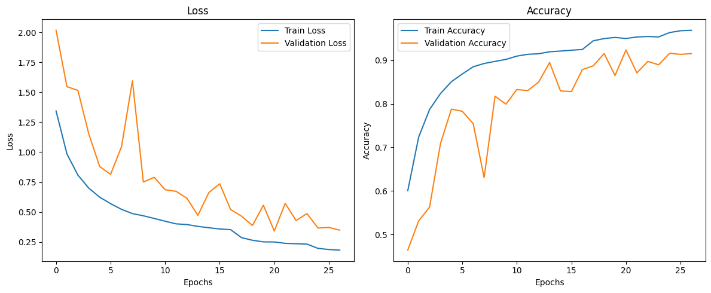

# EuroSAT CNN Classification Project

This project's goal is to use Sentinel-2 data to determine the composition of a ground selection.  
To do so, we use a CNN (Convolutional Neural Network) architecture for the neural network, HTML/CSS/JS for the frontend, and Python with Flask for the backend.

My goal with this project was to learn more about computer vision and CNN architecture and logic. On top of that, it allowed me to link remote sensing and deep learning which are two topics that are important to me.

---

## Project structure

- `CNN_Training.ipynb` – Notebook used to train the CNN on EuroSAT dataset  
- `CNN_Weights.keras` – Saved trained model  
- `CNN_EuroSat.py` – Flask backend for inference  
- `html_carte.html` – Web interface (Leaflet)  
- `css_carte.css` – Stylesheet for the interface  
- `js_carte.js` – Frontend logic (zone selection, sending image to backend)

---

## Dataset

- **EuroSAT**: 27,000 RGB images (64×64 pixels) from Sentinel-2 satellite  
- 10 land use and land cover classes: AnnualCrop, Forest, HerbaceousVegetation, Highway, Industrial, Pasture, PermanentCrop, Residential, River, SeaLake  
- Available through [TensorFlow Datasets](https://www.tensorflow.org/datasets/catalog/eurosat)

---

## Model

The CNN architecture used is a standard sequential model:

- Convolutional layers (64 → 128 → 256 filters) with Batch Normalization and MaxPooling  
- GlobalAveragePooling2D  
- Dense(256, ReLU) + Dropout(0.45)  
- Dense(10, Softmax)

---

## Training results

- Training accuracy: 0.9700
- Validation accuracy: 0.9154
- Test accuracy: 0.9267
- Test loss: 0.3188

Learning curves (loss and accuracy):  



---

## Web application

The application allows the user to select a rectangle on a Leaflet map and run classification on this area.

1. The frontend captures the selected area, resizes it, and sends it to the backend as a base64-encoded image.  
2. The backend (Flask API) tiles the image into 64×64 patches and runs predictions with the trained CNN.  
3. The results are aggregated and displayed in the interface: dominant class and distribution of all classes.

---

## Installation

1. Clone this repository  
2. Install dependencies:

    With pip :
   ```bash
    python -m venv vision; .\vision\Scripts\Activate.ps1
    pip install --upgrade pip tensorflow numpy pillow flask flask-cors scikit-learn matplotlib seaborn ipykernel
   ```

   With conda :

   ```bash
    conda create -n vision
    conda activate vision
    conda install tensorflow numpy pillow flask flask-cors scikit-learn matplotlib seaborn ipykernel
   ```
3. Train the model with the notebook (optional if you use the provided .keras model)
4. Run the backend:

    ```bash
    python CNN_EuroSat.py
    ```
5. Open the interface in your browser at http://localhost:5000/

## Author

This project was initially developed as a bonus for a final year undergraduate project. Since then, it has been developed as my understanding of CNNs and their optimization techniques has grown. It shows and take a step further my intereset in computer vision and remote sensing.

## Limitations and Future Improvements

- The model has some difficulty accurately classifying urban and ocean tiles. This might be because these classes are underrepresented in the dataset or because the current architecture struggles to capture their unique features.
- While several approaches have been explored to address this, a definitive solution hasn't been found yet.
- Moving forward, the focus will be on improving the model's performance for these challenging classes and ensuring that the predictions in the web application are consistent with the reported accuracy metrics.